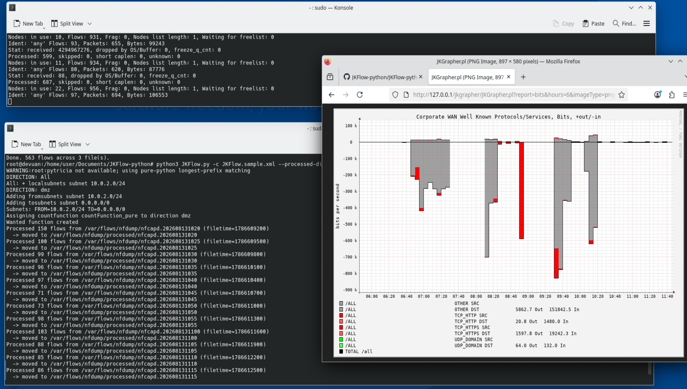

# JKFlow-python

A modern Python re-implementation of the **JKFlow** NetFlow reporting toolchain —
an XML-configurable flow analyzer that counts traffic per subnet, direction,
protocol, and service, and renders it as time-series graphs.



JKFlow began life as `JKFlow.pm`, a Perl reporting module for **FlowScan**. This
project modernizes it: the analyzer is ported to Python, the dead **cflowd**
capture path is replaced with **nfdump / nfcapd**, and the whole pipeline is
packaged for current **Debian 13 (Trixie)** and **Devuan Excalibur** with Ansible.

---

## Project goals

### 1. Port `JKFlow.pm` (Perl) → `JKFlow.py` (Python)

**Status: first working prototype.**

The analyzer is ported and functional: it parses `JKFlow.xml`, reads flows from
nfdump/nfcapd files, counts per subnet / direction / protocol / service, and writes
RRD databases (and optional HTML scoreboards). It runs on Python 3.13 / Devuan
Excalibur today. See the [CHANGELOG](CHANGELOG.md) for the porting history and the
[JKFlow manual](JKFlow-manual.md) for usage.

Not yet done / out of scope for the prototype: IPv6 (the Perl original is IPv4-only),
and performance tuning of the hot path (~800k records/file).

### 2. Port `JKGrapher.pl` → `JKGrapher.py`

**Status: to be done — use `JKGrapher.pl` for now.**

The web grapher (the CGI that turns the RRDs into graphs) has **not** been ported
yet. In the meantime the original Perl `JKGrapher.pl` of the original jkflow project 
works against the RRDs this project produces; the [installation guide](JKFlow-python/INSTALL.md) 
covers serving it under Apache. Porting it to Python is the next major piece of work.

### 3. Move beyond RRDtool

**Status: to be determined.**

RRD served FlowScan well, but its constraints are increasingly limiting: fixed-size
round-robin rollups (retention decided at creation), single-writer updates, awkward
back-filling of historical data, and limited ad-hoc querying. A future direction —
still under evaluation — is a pluggable storage backend so JKFlow can emit to a
modern time-series store (candidates include InfluxDB, VictoriaMetrics,
Prometheus/remote-write, or TimescaleDB) in addition to, or instead of, RRD. No
decision has been made; this goal is intentionally open.

---

## What works today

- **Config parsing** — full `JKFlow.xml` compatibility (subnets, directions,
  services, protocols, scoreboards, AS/router groups).
- **Flow intake** — reads `nfcapd` files via nfdump; tolerant of nfdump version
  differences (1.7 verbose and older terse CSV formats), sub-minute filenames, and
  out-of-order input.
- **Counting engine** — per subnet / direction / protocol / service, in/out split.
- **RRD output** — one update per counter per interval, standard FlowScan RRA set.
- **Operational features** — chronological ordering, `--processed-dir` archiving,
  `--rrd-start` back-fill anchoring, live-file skip.
- **Deployment** — two Ansible playbooks (dependencies; Apache + JKGrapher.pl),
  init-agnostic for Devuan.

---

## Pipeline

```
nfpcapd ──► /var/flows/nfdump/nfcapd.YYYYMMDDHHMM
                     │
                     ▼
                JKFlow.py ──(reads)── JKFlow.xml
                     │
                     ├──► /var/flows/rrds/…      (RRD time-series)
                     ├──► /var/flows/reports/…   (HTML scoreboards, if configured)
                     └──► /var/flows/nfdump/processed/
                     │
                     ▼
              JKGrapher.pl  (Perl CGI, under Apache)  ──► graphs in the browser
```

---

## Repository contents

| File | Description |
|---|---|
| `JKFlow.py` | The ported analyzer (Python). |
| `JKFlow.sample.xml` | Example configuration. |
| `JKFlow.pm` | The original Perl module (reference). |
| `JKGrapher.pl` | The original Perl web grapher (used until goal 2 is done). |
| `install-jkflow-deps.yml` | Ansible: install nfdump + Python runtime. |
| `setup-jkgrapher-apache.yml` | Ansible: serve JKGrapher.pl under Apache. |
| `.yamllint` | Lint config for the playbooks. |
| `INSTALL.md` | Full installation guide. |
| `JKFlow-manual.md` | JKFlow.py usage manual. |
| `CHANGELOG.md` | Version history. |

---

## Quick start

Install dependencies and deploy the analyzer (local machine, Debian/Devuan):

```bash
ansible-playbook -i "localhost," -c local install-jkflow-deps.yml \
    -e jkflow_src=./JKFlow.py
```

Capture flows, then run the analyzer:

```bash
sudo mkdir -p /var/flows/nfdump
sudo nfpcapd -i eth0 -l /var/flows/nfdump -I any -t 300 -P /run/nfpcapd.pid -D

/opt/jkflow/venv/bin/python /opt/jkflow/JKFlow.py \
    -c /usr/local/bin/JKFlow.xml --rrd-start first --processed-dir processed \
    /var/flows/nfdump/nfcapd.20*
```

Serve the (Perl, for now) grapher:

```bash
ansible-playbook -i "localhost," -c local setup-jkgrapher-apache.yml \
    -e jkgrapher_src=./JKGrapher.pl
# then browse to  http://<host>/jkgrapher/JKGrapher.pl
```

Full details in **[INSTALL.md](INSTALL.md)**.

---

## Documentation

- **[INSTALL.md](JKFlow-python/INSTALL.md)** — install Ansible, JKFlow.py dependencies, and the
  Apache/JKGrapher CGI, end to end.
- **[JKFlow-manual.md](JKFlow-python/JKFlow-manual.md)** — JKFlow.py command line, config file,
  workflows, output format, and troubleshooting.
- **[CHANGELOG.md](CHANGELOG.md)** — version history and porting notes.

---

## Roadmap

- **Goal 2:** port `JKGrapher.pl` → `JKGrapher.py` (native Python grapher).
- **Goal 3:** evaluate and prototype a storage backend beyond RRD (pluggable TSDB).
- Boot-time service integration for `nfpcapd` and periodic JKFlow (sysvinit/OpenRC).
- IPv6 support in the analyzer.
- Performance profiling of the per-record hot path.

---

## Background & credits

The original `JKFlow.pm` and `JKGrapher.pl` are by **Jurgen Kobierczynski**, built
on Dave Plonka's FlowScan (`SubnetIO.pm` / `CampusIO.pm`). This project is a
modernization of that FlowScan-era work: same reporting model and configuration,
brought onto current Python, nfdump, and Debian/Devuan.

---

## License

Licensed under the **GNU General Public License, version 3 (GPLv3)**. See the
[LICENSE](LICENSE) file for the full text.

This project derives from the FlowScan ecosystem (Dave Plonka's `SubnetIO.pm` /
`CampusIO.pm`) and Jurgen Kobierczynski's `JKFlow.pm` / `JKGrapher.pl`, consistent
with GPL licensing.

```
JKFlow-python — XML-configurable NetFlow reporting
Copyright (C) 2026  Jurgen Kobierczynski

This program is free software: you can redistribute it and/or modify
it under the terms of the GNU General Public License as published by
the Free Software Foundation, either version 3 of the License, or
(at your option) any later version.

This program is distributed in the hope that it will be useful,
but WITHOUT ANY WARRANTY; without even the implied warranty of
MERCHANTABILITY or FITNESS FOR A PARTICULAR PURPOSE.  See the
GNU General Public License for more details.
```
